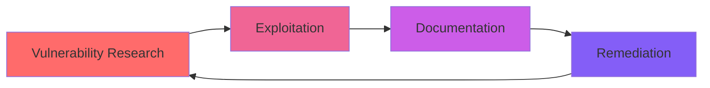

<div align="center">

# 🛡️ Gurpreet Singh
### Red Team Engineer in Training | Offensive Security Specialist


[](https://github.com/Gurpreet-Singh-offensive-Security/Offensive-Security-Labs)

---

**Gurpreet Singh** - Offensive security researcher specializing in web application penetration testing, vulnerability research, and red team operations. Documenting 150+ hands-on exploitation labs using Burp Suite Professional and advanced attack techniques.

</div>

---

## 🎯 About Me

I'm **Gurpreet Singh**, an aspiring Red Team Engineer building expertise through intensive hands-on penetration testing and vulnerability research. My focus is on practical, real-world offensive security techniques with comprehensive documentation of every exploitation.
```
🔴 Offensive Security    🐧 Linux Security        💻 Red Team Ops
🔐 Web App PenTest      🐍 Python Automation     📝 Technical Writing
```

---

## 🚀 Current Focus

<table>
<tr>
<td width="50%">

### 🔐 Web Application Security
- **150+ exploitation labs** (PortSwigger Academy)
- OWASP Top 10 vulnerabilities
- Authentication & session attacks
- Business logic exploitation

</td>
<td width="50%">

### 🛠️ Tools & Technologies
- **Burp Suite Professional** (Licensed)
- Kali Linux & penetration testing tools
- Python scripting for automation
- Custom exploit development

</td>
</tr>
</table>

---

## 💼 Featured Project

### 🎯 [Offensive Security Labs](https://github.com/Gurpreet-Singh-offensive-Security/Offensive-Security-Labs)

> **Comprehensive documentation of web security exploitation and red team techniques**

<details>
<summary><b>📊 Project Statistics</b></summary>

| Category | Status | Labs Completed |
|----------|--------|----------------|
| 🔓 Authentication Attacks | ✅ Complete | 14 labs |
| 🧩 Business Logic Flaws | ✅ Complete | 5 labs |
| 💉 SQL Injection | 🔄 In Progress | Coming soon |
| 🎨 Cross-Site Scripting (XSS) | 🔄 In Progress | Coming soon |
| 🔗 CSRF & Session Attacks | 📋 Planned | Coming soon |

**Total Progress:** 20+ labs completed | **Goal:** 150+ by 2027

</details>

<details>
<summary><b>🔍 What's Inside</b></summary>

- ✅ **Detailed exploitation walkthroughs** with step-by-step methodology
- ✅ **Professional documentation** including CVSS scoring and impact analysis
- ✅ **Custom Python scripts** for attack automation
- ✅ **Screenshot evidence** of successful exploitations
- ✅ **Remediation guidance** and secure coding recommendations

**Recent Highlights:**
- 🎯 Broken Brute-Force Protection Bypass (Turbo Intruder)
- 🎯 2FA Bypass Techniques
- 🎯 Session Hijacking & Fixation Attacks
- 🎯 Password Reset Poisoning

</details>

---

## 🔧 Technical Arsenal

### Offensive Security Expertise
```python
skills = {
    "Web Application PenTest": [
        "SQL Injection (SQLi)",
        "Cross-Site Scripting (XSS)", 
        "Authentication Bypass",
        "CSRF & Session Attacks",
        "Business Logic Exploitation"
    ],
    "Tools & Platforms": [
        "Burp Suite Professional",
        "Kali Linux",
        "Python (Security Automation)",
        "Bash Scripting",
        "Turbo Intruder"
    ],
    "Red Team Operations": [
        "Reconnaissance & OSINT",
        "Vulnerability Research",
        "Exploit Development",
        "Privilege Escalation",
        "Attack Chain Documentation"
    ]
}
```

### Learning & Development


---

## 📈 Professional Roadmap

<table>
<tr>
<td align="center" width="33%">

### 2025
**Web Security Fundamentals**

🎯 OWASP Top 10 Mastery  
🔐 Authentication Attacks  
🧩 Business Logic Flaws  
💉 SQL Injection Techniques  

</td>
<td align="center" width="33%">

### 2026
**Advanced Exploitation**

🚀 Complex Attack Chains  
🛠️ Custom Tool Development  
📊 Advanced Web Attacks  
🔴 Red Team Techniques  

</td>
<td align="center" width="33%">

### 2027
**Certification & Career**

✅ 150+ Labs Complete  
🎓 Security+ Certification  
💼 Red Team Engineer Role  
🌟 Professional Portfolio  

</td>
</tr>
</table>

---

## 🎯 Mission & Vision

<div align="center">

### 🚀 Current Mission (2025-2027)

*Master web application security through 150+ practical exploitation labs, focusing on real-world attack techniques and professional documentation that demonstrates deep technical expertise.*

### 🌟 Long-term Vision

*Become a Red Team Engineer specializing in offensive security operations, attack simulation, and advanced penetration testing for enterprise environments.*

</div>

---

## 📊 GitHub Activity


---

## 🤝 Let's Connect

<div align="center">

**Building skills for future red team opportunities | Open to learning from experienced security professionals**

[](mailto:gskhalsa6245@gmail.com)
[](https://github.com/Gurpreet-Singh-offensive-Security/Offensive-Security-Labs)

### 📫 Professional Opportunities

💼 **Open to:** Red Team Internships | Security Research Collaboration | Mentorship  
🌍 **Location:** Canada  
🎯 **Specialization:** Web Application Penetration Testing | Offensive Security  
🛡️ **Focus Areas:** OWASP Top 10 | Authentication Attacks | Exploit Development  

</div>

---

<div align="center">

### 💡 Quote I Live By

*"The only truly secure system is one that is powered off, cast in a block of concrete and sealed in a lead-lined room with armed guards."* - Gene Spafford

---

**Gurpreet Singh** | Offensive Security Researcher | Red Team Operations  
🔴 Penetration Testing • 🛡️ Web Application Security • 🎯 Vulnerability Research

*Last Updated: January 2026*

</div>
